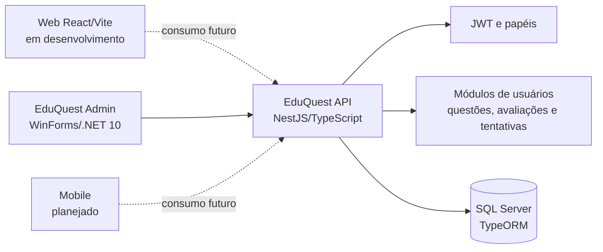

# EduQuest

Plataforma acadêmica para criação, distribuição e acompanhamento de avaliações. O projeto reúne uma API central e interfaces destinadas a diferentes perfis da instituição de ensino, com foco em uma base que possa evoluir para experiências web, desktop e mobile.

## Propósito

Processos de avaliação costumam ficar fragmentados entre planilhas, formulários e sistemas diferentes. O EduQuest busca centralizar usuários, questões, avaliações e resultados em uma API com regras de acesso por perfil.

## Funcionalidades

### Implementadas

- Autenticação por e-mail e senha com emissão de JWT.
- Perfis `admin`, `teacher` e `student`, protegidos por autorização baseada em papel.
- Gestão administrativa de usuários: criação, listagem, edição de nome/e-mail/senha e desativação.
- Seed de um administrador e de uma questão inicial em ambiente configurado.
- Consulta do banco de questões por professores.
- Criação de avaliações por professores usando questões existentes.
- Consulta, por alunos, de avaliações ainda dentro do prazo.
- Envio de tentativas de avaliação, validação das respostas e cálculo de pontuação.
- Ranking dos alunos com base nas pontuações registradas.
- Aplicação desktop administrativa com login e gestão de usuários pela API.
- Documentação interativa da API com Swagger.

### Parciais

- A aplicação web possui uma interface de professor em desenvolvimento, mas a entrada atual ainda não a conecta a um fluxo funcional completo nem à API.
- O aplicativo desktop possui testes automatizados para partes do cliente HTTP e da sessão; os fluxos integrados contra uma API em execução ainda dependem de validação manual.

### Planejadas

- Aplicação mobile. O diretório `apps/mobile` atualmente contém apenas um arquivo preparatório vazio, portanto não há aplicativo mobile funcional neste momento.
- Evolução das interfaces web para autenticação, consumo da API e fluxos completos de professor e aluno.
- Cadastro público, edição de avaliações e outras capacidades que não fazem parte do escopo implementado atual.

## Tecnologias

| Aplicação | Tecnologias | Responsabilidade |
| --- | --- | --- |
| `apps/server` | NestJS, TypeScript, TypeORM, SQL Server, JWT, Swagger | API, regras de negócio, autenticação e persistência |
| `apps/web` | React 19, Vite, React Router, Tailwind CSS, shadcn/ui | Interface web em desenvolvimento |
| `apps/desktop` | C#/.NET 10, Windows Forms, `HttpClient`, MSTest | Operação administrativa em Windows |
| `apps/mobile` | Planejado | Não implementado |

## Arquitetura



As aplicações cliente não acessam o banco diretamente. A API concentra autenticação, autorização, validação e persistência; o aplicativo desktop já consome suas rotas administrativas, enquanto a integração web e mobile permanece em evolução.

## Organização do repositório

```text
apps/
  server/       API NestJS e testes Vitest
  web/          Interface React/Vite
  desktop/      Aplicação administrativa WinForms e testes MSTest
  mobile/       Espaço reservado para a futura aplicação mobile
```

- `apps/server/src/auth`: login, JWT, papéis e operações administrativas.
- `apps/server/src/users`: entidade e persistência de usuários.
- `apps/server/src/question`: questões e seed inicial.
- `apps/server/src/exam`: criação e consulta de avaliações.
- `apps/server/src/attempt`: envio de respostas, pontuação e ranking.
- `apps/desktop/src`: cliente administrativo, sessão, formulários e modelos da API.
- `docs`: documentação técnica existente, incluindo diagramas e registros de decisões.

## Execução local

### API com Docker Compose

Pré-requisitos: Docker e Docker Compose.

```bash
cd apps/server
cp .env.example .env
docker compose up --build
```

O arquivo `.env` deve conter os valores locais para `DB_PASS`, `JWT_SECRET`, `ADMIN_NAME`, `ADMIN_EMAIL` e `ADMIN_PASSWORD`. Não use credenciais reais no repositório. A API ficará disponível em `http://localhost:3000` e o SQL Server em `localhost:1433`.

### API sem Docker

Pré-requisitos: Node.js compatível com o projeto e uma instância SQL Server configurada.

```bash
cd apps/server
npm ci
npm run start:dev
```

Configure as variáveis de ambiente do banco e da aplicação antes de iniciar.

### Interface web

```bash
cd apps/web
npm install
npm run dev
```

O Vite informará a URL local no terminal. O estado atual da interface está detalhado em [`apps/web/README.md`](apps/web/README.md).

### Aplicação desktop

Pré-requisitos: Windows e .NET 10 SDK.

```powershell
cd apps/desktop
dotnet run --project src/EduQuest.Admin.Desktop
```

Por padrão, o cliente usa `http://localhost:3000`. Para apontar para outra API:

```powershell
$env:EDUQUEST_API_URL = "https://sua-api.example"
dotnet run --project src/EduQuest.Admin.Desktop
```

## Testes e verificações

### Servidor

```bash
cd apps/server
npm test
npm run test:e2e
npm run test:cov
npm run lint
npm run build
```

Os testes unitários ficam próximos aos módulos em `apps/server/src`; o teste end-to-end está em `apps/server/test`.

### Desktop

```powershell
cd apps/desktop
dotnet test
dotnet build
```

Além dos testes automatizados, o README do desktop descreve os cenários manuais de login e gestão de usuários.

### Web

```bash
cd apps/web
npm run lint
npm run build
```

## Status atual

O backend possui os principais fluxos de autenticação, usuários, questões, avaliações e tentativas implementados e testados em nível unitário. A aplicação administrativa desktop já executa login e operações de usuários pela API. A interface web e a aplicação mobile ainda não representam uma experiência completa de produto: a primeira está em desenvolvimento e a segunda permanece planejada.

## Documentação relacionada

- [Documentação da API](apps/server/README.md)
- [Aplicação web](apps/web/README.md)
- [Aplicação desktop](apps/desktop/README.md)
- [Documentação técnica](docs/)
