# Diagrama de Classes do Backend

Este diagrama representa as classes da aplicação NestJS. Dependências tracejadas entre entidades representam referências por identificador, não relações TypeORM ou chaves estrangeiras.

```mermaid
classDiagram
    class UserRole {
        <<enumeration>>
        admin
        teacher
        student
    }

    class User {
        <<entity>>
        +string id
        +string name
        +string email
        +string passwordHash
        +UserRole role
        +boolean isActive
    }

    class Question {
        <<entity>>
        +string id
        +string prompt
        +string[] options
        +number correctOptionIndex
    }

    class Exam {
        <<entity>>
        +string id
        +string teacherId
        +string title
        +string description
        +Date deadline
        +string[] questionIds
        +Date createdAt
    }

    class Attempt {
        <<entity>>
        +string id
        +string studentId
        +string examId
        +JSON[] answers
        +number score
        +number totalQuestions
        +Date createdAt
    }

    class CreateUserDto {
        <<DTO>>
        +string name
        +string email
        +string password
        +UserRole role
    }

    class LoginDto {
        <<DTO>>
        +string email
        +string password
    }

    class RegisterDto {
        <<DTO>>
        +string name
        +string email
        +string password
    }

    class UpdateUserDto {
        <<DTO>>
        +string name
        +string email
        +string password
    }

    class CreateExamDto {
        <<DTO>>
        +string title
        +string description
        +string deadline
        +string[] questionIds
    }

    class AnswerDto {
        <<DTO>>
        +string questionId
        +number selectedOptionIndex
    }

    class SubmitAttemptDto {
        <<DTO>>
        +AnswerDto[] answers
    }

    class UsersService {
        <<service>>
        +findByEmail(email: string) User
        +findById(id: string) User
        +findAll() User[]
        +create(user: User) User
        +update(id: string, user: object) User
        +deactivate(id: string) User
    }

    class AuthService {
        <<service>>
        +createUser(name: string, email: string, password: string, role: UserRole) User
        +updateUser(id: string, data: object) User
        +deactivateUser(id: string) User
        +listUsers() User[]
        +seedAdmin(name: string, email: string, password: string) void
        +login(email: string, password: string) object
        -hashPassword(password: string) string
        -publicUser(user: User) User
        -passwordMatches(password: string, passwordHash: string) boolean
    }

    class QuestionService {
        <<service>>
        +findAll() Question[]
        +findByIds(ids: string[]) Question[]
        +seedInitialQuestion() void
    }

    class ExamService {
        <<service>>
        +create(teacherId: string, dto: CreateExamDto) Exam
        +findFuture(now: Date) Exam[]
    }

    class AttemptService {
        <<service>>
        +submit(studentId: string, examId: string, answers: JSON[]) object
        +getLeaderboard() object[]
    }

    class AdminSeedService {
        <<seed>>
        +onApplicationBootstrap() void
        -seedDemoUser(name: string, email: string, role: string) void
    }

    class QuestionSeedService {
        <<seed>>
        +onApplicationBootstrap() void
    }

    class UsersController {
        <<controller>>
    }

    class AuthController {
        <<controller>>
        +login(dto: LoginDto) object
        +createUser(dto: CreateUserDto) User
        +listUsers() User[]
        +updateUser(id: string, dto: UpdateUserDto) User
        +deactivateUser(id: string) User
    }

    class QuestionController {
        <<controller>>
        +findAll() Question[]
    }

    class ExamController {
        <<controller>>
        +create(request: object, dto: CreateExamDto) Exam
        +findFuture() Exam[]
    }

    class AttemptController {
        <<controller>>
        +submit(request: object, examId: string, dto: SubmitAttemptDto) object
    }

    class LeaderboardController {
        <<controller>>
        +findAll() object[]
    }

    class JwtAuthGuard {
        <<guard>>
        +canActivate(context: object) boolean
    }

    class RolesGuard {
        <<guard>>
        +canActivate(context: object) boolean
    }

    class AppModule {
        <<module>>
    }

    class UsersModule {
        <<module>>
    }

    class AuthModule {
        <<module>>
    }

    class QuestionModule {
        <<module>>
    }

    class ExamModule {
        <<module>>
    }

    class AttemptModule {
        <<module>>
    }

    User --> UserRole : role
    CreateUserDto --> UserRole : role

    SubmitAttemptDto "1" *-- "1..*" AnswerDto : answers

    AuthController --> AuthService
    QuestionController --> QuestionService
    ExamController --> ExamService
    AttemptController --> AttemptService
    LeaderboardController --> AttemptService
    AdminSeedService --> AuthService
    QuestionSeedService --> QuestionService

    AuthController ..> LoginDto
    AuthController ..> CreateUserDto
    AuthController ..> UpdateUserDto
    ExamController ..> CreateExamDto
    AttemptController ..> SubmitAttemptDto

    UsersService ..> User : persists
    AuthService --> UsersService
    AuthService ..> UserRole
    QuestionService ..> Question : persists
    ExamService ..> Exam : persists
    ExamService --> QuestionService
    ExamService ..> CreateExamDto
    AttemptService ..> Attempt : persists
    AttemptService ..> Exam : queries
    AttemptService --> QuestionService
    AttemptService ..> User : leaderboard

    JwtAuthGuard --> UsersService
    RolesGuard ..> UserRole

    AuthController ..> JwtAuthGuard : guarded by
    AuthController ..> RolesGuard : guarded by
    QuestionController ..> JwtAuthGuard : guarded by
    QuestionController ..> RolesGuard : guarded by
    ExamController ..> JwtAuthGuard : guarded by
    ExamController ..> RolesGuard : guarded by
    AttemptController ..> JwtAuthGuard : guarded by
    AttemptController ..> RolesGuard : guarded by
    LeaderboardController ..> JwtAuthGuard : guarded by
    LeaderboardController ..> RolesGuard : guarded by

    AppModule ..> UsersModule : imports
    AppModule ..> AuthModule : imports
    AppModule ..> QuestionModule : imports
    AppModule ..> ExamModule : imports
    AppModule ..> AttemptModule : imports

    UsersModule ..> UsersController : controller
    UsersModule ..> UsersService : provides
    UsersModule ..> User : registers

    AuthModule ..> UsersModule : imports
    AuthModule ..> AuthController : controller
    AuthModule ..> AuthService : provides
    AuthModule ..> JwtAuthGuard : provides
    AuthModule ..> RolesGuard : provides
    AuthModule ..> AdminSeedService : provides

    QuestionModule ..> AuthModule : imports
    QuestionModule ..> QuestionController : controller
    QuestionModule ..> QuestionService : provides
    QuestionModule ..> QuestionSeedService : provides
    QuestionModule ..> Question : registers

    ExamModule ..> AuthModule : imports
    ExamModule ..> QuestionModule : imports
    ExamModule ..> ExamController : controller
    ExamModule ..> ExamService : provides
    ExamModule ..> Exam : registers

    AttemptModule ..> AuthModule : imports
    AttemptModule ..> QuestionModule : imports
    AttemptModule ..> AttemptController : controller
    AttemptModule ..> LeaderboardController : controller
    AttemptModule ..> AttemptService : provides
    AttemptModule ..> Attempt : registers
    AttemptModule ..> Exam : registers

    Exam ..> User : teacherId
    Exam ..> Question : questionIds
    Attempt ..> User : studentId
    Attempt ..> Exam : examId
    Attempt ..> Question : answers.questionId

    note for Attempt "Restricao unica: studentId + examId"
    note for AttemptService "Cada acerto vale 10 pontos; leaderboard retorna os 20 maiores totais"
```

## Escopo

- Inclui todas as 32 classes declaradas no código do backend, além do tipo `UserRole` representado como enumeração.
- Isso abrange entidades, DTOs, controllers, services, guards, módulos da aplicação, classes de seed, `UsersController` e o `RegisterDto` ainda não utilizado.
- Omite somente classes, interfaces e serviços fornecidos pelo NestJS, TypeORM, Express e demais bibliotecas.
- Tipos estruturais que não são classes declaradas no backend aparecem como `object` ou `JSON` para não gerar classes artificiais no Astah.
- `Attempt.score` armazena acertos; `pointsEarned` e o leaderboard são calculados por `AttemptService`.
- `UpdateUserDto` possui campos opcionais, embora o Mermaid não expresse opcionalidade de TypeScript diretamente.
